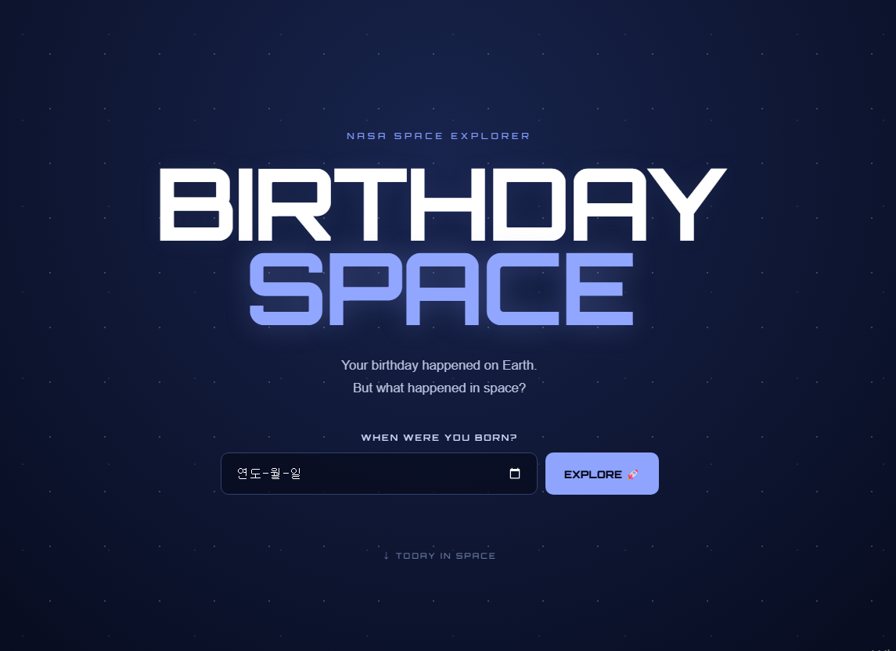
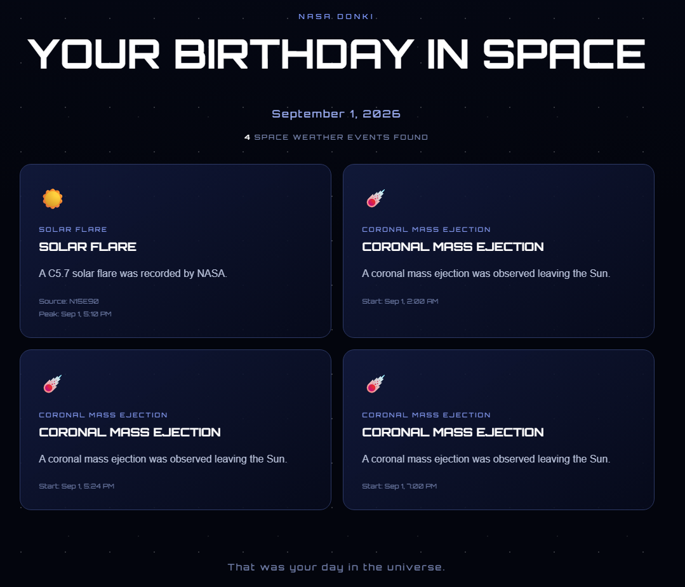

# Birthday Space

Haven't you ever wondered what happened in space on your birthday?

No?.......... Well, it can't be helped.



Birthday Space uses NASA DOKKI to show you what happened in space on your birthday.

## Very Important [Things to Know]

NASA's DOKKI service officially launched in 2013.

Based on my research, it is estimated that data began accumulating around September 2011. Therefore, unfortunately, the birthday system, which is the core of this website, will only work for those born in September 2011 or later. (However, since I haven't tested every single date, it might work, but generally, it will show that there is no data.)

I apologize for not being able to support everyone.

## Live Link

https://d08835149-prog.github.io/birthday-space/

## Features

- NASA Astronomy Picture of the Day

- Birthday Search

## Types of Results When Searching for Birthdays

- Solar Flares

- Coronal Mass Ejections

- Geomagnetic Storms

- Solar High Energy Particles



## API

- NASA APOD

- NASA DONKI

## Development Tools

- HTML

- CSS

- JavaScript

- Vite

## Local Execution

Clone repository:

```bash

git clone https://github.com/d08835149-prog/birthday-space.git

cd birthday-space

```

Install dependencies:

```bash

npm install

```

Create `.env` file File:

```env

VITE_NASA_API_KEY=your_nasa_api_key

```

Start development server:

```bash

npm run dev

```